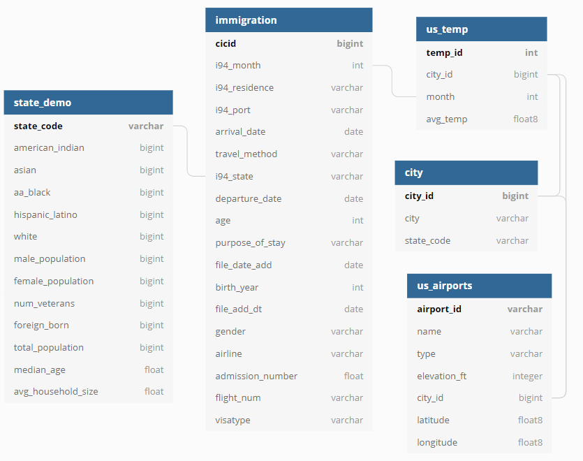

# Project Details
This purpose of this project is to create a database that can be used as a resource for international immigrants and the US governement. The central idea to create a source of truth database that can be used in two ways.

For the US government there's a wide range of analytics that can be performed on this data that can help policy makers make informed decisions on immigration. It is broadly structured so that analysts can dig into the data and perform ad hoc on the patterns of immigrants- when do they come, where are they coming from, why are they coming, and how long are they staying?

For immigrants this data could be integrated into an app that helps immigrants plan their stay in the united states. In a sesne by understanding immigration patterns, immigrants can see others have successfully made it over and how they did it. This would of course require an entire infrastructure and more people to maintain the app than a simple databasse used for analytics.

To accomplish this we need a few key data sources.

# Data Sources
 This project draws from four different data sets. The following sets are as follows:

 - I94 immigration data : this data set comes from the US National Tourism and Trade Office and can be found [here] (https://travel.trade.gov/research/reports/i94/historical/2016.html) __Data Type: sas7bdat__
 - Airport code data : comes from datahub and can be found [here](https://datahub.io/core/airport-codes#data) __Data Type: csv__
 - World Temperature data : comes from kaggle and can be found [here](https://www.kaggle.com/berkeleyearth/climate-change-earth-surface-temperature-data) __Data Type: csv__
 - U.S. City Demographic Data : comes from Opensoft and comes from [here](public.opendatasoft.com/explore/dataset/us-cities-demographics/export/) __Data Type: csv__

# Project Scope/Outline

The first guiding principal for these data sets is to figure out at what level of granularity can each df connect to at least one other data set. After finding what is possible we aggregate the data and connect the data on the following common fields:

- city_id
- month
- state_code

After these connections we sift through the data to eliminate duplicates and fields that have too many null or nan values. By duplicates I don't mean just duplicate records. In some cases one field in a table has almost the same information but also more null values. In this situation the field holding the greater number of values is kept while the other deleted. Additionally all fields that had more than half of the values as null were deleted.

 __US city demographics dataset__
 While exploring this dataset I realized that because each record was based from the perspective of a race demographic it would be difficult to make clear connections to other tables. I had to find a primary key that would potentially join with other tables. Additionally, because the city values did not align with the cities in the other data sets, I decided to aggregate the data on a state level and create fields for each of the demographics. With this table now normalized, we can join it with the state column in the i94 immigration data.

 __World Airport and Temperature data__
 In order to tie these tables together and increase normalization a city table was created from the other datasets.
 To help focus the database to US immigration, the airport and temperature data were sliced down to only include airports and temperature records for cities in the United States. With this paring down, __all data sets are now focused on happenings and details in the United States.__ The temperature data still needed to be consolidated because even though the table only contained data pertaining to the untied states, it contained temperature data for over a hundred years. As a means of normalizing the data set and producing value to the other tables, we can take an average for each month for each city in the table. This clarifies the data and provides a general guideline for temperature values for each city depending on the time of year. This could have potentially been consolidated further into seasons, but that's a better judgement for the analysts that would use this later.

 __i94 Immigration data__
 This data set is the focus of the database and required greater cleaning and judgement calls than the other datasets. Duplicate records and certain fields were removed if they had more than half of their values as null. Additionally, to help analysts get the most out of this data, I used the SAS data label file to map new field names to the table to give a clearer initial view of the data. I also used the same file to create a python dictionary to map string values to the number values. Thus, instead of getting the result of '209.0' as the immigrant's native country, we can see that they are from Japan. I also standardized the format of the date data to make it readable for analysts/humans. At the end of the mapping, only a few fields required domain knowledge to understand trends in the data (i.e. visa_type). Like many data projects I tried to strike the balance of simplifying the data without eliminating too much detail.

# Data Model

This database is relational star schema where the purpose of the DB centers around the immigrants table. However, this model does not follow the strict structure of a star schema in the sense that every dimension table connects directly to the fact table. The dimension tables do provide context for immigration patterns that can help for better decision making. The dimension tables are shaped and truncated with the express purpose of helping International citizens and the US government plan for successful US immigration problems.

## Business usage model

This data usage model has a design similar to a Hybrid Kimball Bus and Inmon CIF. The set up gives the business/data analysts access to source data (found in the s3 bucket) to find the any other insights themselves. Additionally the DB has a unified schema design that can be helpful for multiple parties involved.

The rational for this choice is to democratize the data in a way that multiple people can access the data while at the same time providing multiple avenues to load and platy with the data. By having Redshift functionality, the skill threshold is lower to help people from all backgrounds get into the data. Additionally by having stored files in s3 (both raw and final data), this gives the organization a greater agility to mold the data as needs change (maybe you find you will want data marts for specific users). In a practical sense organizations merge and new contracts are signed with new companies, so if you want to change technologies you can migrate your data easily as well.

# Table Schemas and Purpose

 1. __city__: This table contains a city_id for every US city in the database. This helps consolidate data across the other tables that are organized on the city level. __Primary Key = city_id__
 2. __us_demo__: This table is organized on a state level and gives the US state demographics across gender, race and household statistics. This can help potential immigrants and the government plan for smoother immigrartion. __Primary Key = state_code__
 3. __airports__: This table provides all identification information for US airports by airport code. This can help immigrants to know which airports are more likely to take incoming international flights (larger airports). This table can connect to the temp table to help prospective immigrants to know what temperatures to expect in each state. __Primary Key = airport_id__
 4. __temp__: This table uses 100 years of data to create temperatures averages by US city and month. The idea is that months away, immigrants can know what type of temperatures to expect when they arrive in the US. However, this obviously does not take into account climate change. Such accuracy woud requre specific domain knowledge and algortithms that are outside the scope of this project. __Primary Key = temp_id__
 5. __immigration__: This table provides helpful demographics to the US governemnt to know who is coming to the country, for how long and for what purpose. This can help the govrernment to investigate the needs of immigrants and create better policies that will help immigrants and the country prosper. This table can also connect to the us_demo table to help know where in the US immigrants are settling. __Primary Key = cic_id__

### Note
Because Redshift does not enfore the constraints of conventional primary keys, there is no explicit contraint assigned in the SQL code of the sql_queries.py file. Instead, users can see if the primary keys have any null values when running the redshift_etl.py file. This is where the quality checks come in. The output of the run will return the number of records for each table as well as the number of null values in the primary key for each table.

### Full Schema design

# Tools Used

Tools used for this project:

__Apache Spark (Pyspark)__
__AWS S3, EMR__ (1 governing node and 2 worker nodes), __EC2__, and __Redshift__

This project uses spark mainly becuase of the great quantity of data in the main immigration data table. Spark also allows for easy data integration as it continually creates copies of tables. This feature allows the engineer to mold and write data as easily as SQL databases.

AWS provides the horsepower and easy storage for this database. I used AWS EMR (with EC2) because the the spark dependencies come preloaded. This means that I get the power of a cluster without having to manually set up the dependencies on each cluster. Also, If I need to add greater functionality I can easily add other packages or capabilities through Bootstrap scripts upon startup.

I used s3 both for raw and processed data because it can be a major money saver if the company or branch I'm working in wants to save some money. I stored the processed files in parquet format to save space and money in the S3 bucket.

I also included the usage of Redshift so that it people from all backgrounds could explore the data themselves. Part of having a healthy data centric organization is to make sure that multiple stakeholders have access to the data. Anyone that has decent experience with SQl can find insights themselves. Using Redshift incurs a greater cost but it can help in collaboration settings.

# Data Updates

Because the data is not time critical the data could be updated once a week to once a month. The immigration and weather tables are both partitioned by month. The data by nature is to get an understanding of broad immigration patterns. The purpose is to help individuals to know when to go to the united states and where to settle (based on their preferences). This also helps govenerments to enact policies that help new immigrants wherever they choose to settle in the US.

Such a database does not really work on the granularity of hours or days, so updating the DB on the same respective granulaity wouldn't make sense.

# What if the organization's needs change?

__What if the data was 100 times larger than the current data set?__

Redshift can handle big reads and writes so there wouldn't need to be a change here. I would probably have to allocate more nodes for the emr cluster to scale with the data. I could also consider using more powerful nodes.

__What if the data had to be uploaded at 7am daily?__

In this case I would definitely need to use airflow and have a daily SLA put in place.
I would have daily quality checks and have email notifications setup to make sure that there weren't any transfer failures.

__What if the database needed to be accessed by 100 people?__

AWS redshift is designed for this type of collaboration. As long as those 100 people have the proper AWS credentials (IAM key and secret key) each person would be able to do their own exploration and reports.

 # Directions

 1. Enter all credentials and paths for AWS technologies into the dl.cfg file and save it.
 2. Open a terminal and run `python s3_upload.py`. This will transfer all relevant data to an s3_bucket of your choosing (can be modified from within the s3_upload.py script)
 3. Move all files in the root directory to the emr cluster. If using windows you can use winscp to do that. Find out how to do that [here](https://winscp.net/eng/docs/guide_amazon_ec2)
 4. Connect to an AWS EMR cluster (create one through the AWS interface or through Iac) using bash (if on linux or mac) or Putty (if on windows). You can find out how to do that [here](https://docs.aws.amazon.com/emr/latest/ManagementGuide/emr-connect-master-node-ssh.html)
 5. In the terminal after SSH login, type in `spark-submit --packages saurfang:spark-sas7bdat:2.1.0-s_2.11 s3_etl.py` and hit enter. This will extract the data for all tables, shape them, and write them into a processed data lake folder as parquet files (again you can change this bucket location inside the s3_etl.py script).
 7. Next type in `python redshift_etl.py` (make sure to type in the credentials for the redshift cluster that you're using in the redshift_etl.py script). This will create the tables in redshift, load the data from the output s3_bucket and run quality tests on the data.

 You can now query the data in redshift or transfer the processed data to a new location.
